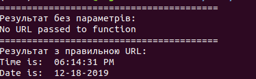
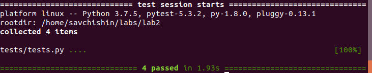

## Lab2: Автоматизація. Знайомство з CI/CD.

1. Встановив на свою машину pipenv та python 3.7
2. Встановив бiблiотеки requests та ntplib.
3. За допомогою команди **python app.py** запустив програму, результат виконання:

4. Встановив бiблiотеку pytest, запустив тести якi пройшли успiшно.

5. Дописав функцiю для вiдображення дня/вечора та тести.
6. Вiдредагував файл makefile згiдно з завданням та запустив його.
