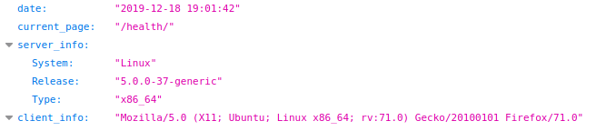
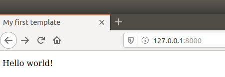

## Lab3

1. Встановив django та створив свiй проект.
2. Запустив сервер та перевiрив працездатнiсть.

3. iнсталював додаток main, налаштував потрiбнi файли
4. Запустив сервер та перевiрив його

5. Встановив бiблiотеку requests та файл монiторингу.
