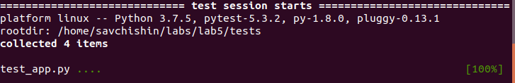
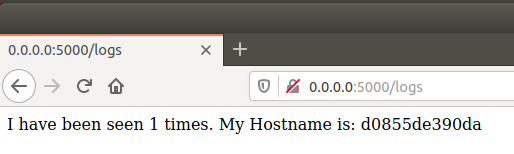

## Lab5

1. Скопiював репозиторiй на свiй пк.
2. Запустив проект. Проект запустився успiшно, проте виникли помилки при переходi на сторiнки. Виправивши помилки, я запустив тести якi пройшли успiшно.

3. Ознайомився з вмiстом Докерфайлу та Мейкфайлу, ознайомився зi всiма директивами.
4. За допомогою команд sudo make tests та sudo make app збiлдив iмеджi докеру. Та запустив проект за допомогою команди sudo make run.
5. Проект успiшно запустився та працюють переходи на всi сторiнки.

6. Запушив iмеджi на репозиторi Докер. 
